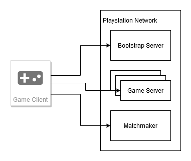
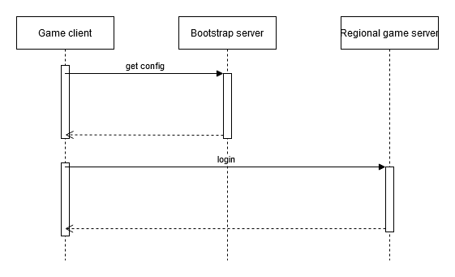

# Demon's Souls Server API
Demon's Souls brought From Software's unique asynchronous multiplayer to the
gaming world for the first time in 2009. This emulated server replaces the
core part of the infrastructure that the game interacts with.

## Topology
There are 3 elements in the Demon's Souls multiplayer infrastructure:

1. Game client
2. Game server
3. Sony Playstation Network

The game server handles all state management and interaction to power features
such as:

* World Tendency
* Messaging
* Replays
* Bloodstains
* Wandering ghosts
* Summoning

The latter of these, summoning, is where Sony Playstation Network comes into
play. The game client can request or offer assistance to other players, via the
summon sign mechanic. The game server stores the state of the summons, but it
is the responsibility of Playstation Network to actually perform the match
making for valid summon signs. This interaction comes from the game client and
not the game server.

The game server itself comprises 2 components; technically _at least_ 2. The
first component is the "bootstrap" and _n_ instances of regional game servers.



## Bootstrap Server
The bootstrap server is responsible for configuring a game client that has
just booted up. It provides configuration information for the client to operate
its multiplayer functions and also advertises URLs for regional game servers.



### Transport
The server uses a standard HTTP/1.1 protocol.

### Endpoints

See the [swagger](swagger.yaml) file in the root of this repo, under the
"boostrap" section.

## Game Server
The Demon's Souls game server is responsible for handling interactions with the
game client to power it's asynchronous multiplayer functionality. Persistent
storage is used to store data for player characters, replays and messages left
in the game world.

### Transport
The server uses a standard HTTP/1.1 protocol.

### Request
Demon's Souls makes API requests using standard HTTP verbs (e.g. POST) but with
encrypted contents. The body of an API request is an AES encrypted representation
of an HTTP form POST. Requests are encrypted using the AES key `11111111222222223333333344444444`

As an example, first imagine a POST body like so:

```
ver=100&characterID=foobar&index=1
```

The game client would then need to AES encrypt this using the known key. This
encryption method works using blocks (16 bytes in size), as a result the raw
value may need to be padded to the next whole block (i.e. the length must be a
multiple of the block size). As a result, when decrypting the POST body into set
of HTTP url params, you may see a trailing ampersand.

### Response
Responses sent back from the server to the game client are not encrypted. Instead,
they are base64 encoded byte sequences. It should also be noted that the byte
sequence is expected to be followed by a new line character, otherwise the
game client cannot parse it.

The format of the byte sequence in a server response is as follows:

| 0            | 1 .. 4      | 5 .. n |
| :----------- | :---------- | :----- |
| Command flag | Data length | Data   |

The command flag is a single byte that indicates to the game client the type
of response being returned.

### Endpoints

See the [swagger](swagger.yaml) file in the root of this repo, ignoring the
"boostrap" section.

A caveat of this swagger file is that the request bodies are not representative
of what the game will actually be sending. The case of the fields will be
different, and as discussed above, the body will be encrypted. The examples
shown in the swagger are purely for illustration purposes.

Similarly, the response bodies will be byte sequences which are not representable
inside a swagger file.
